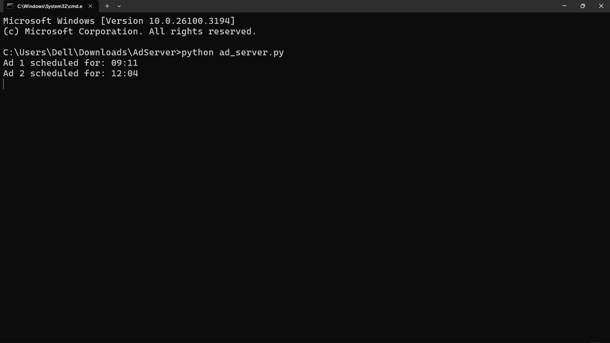
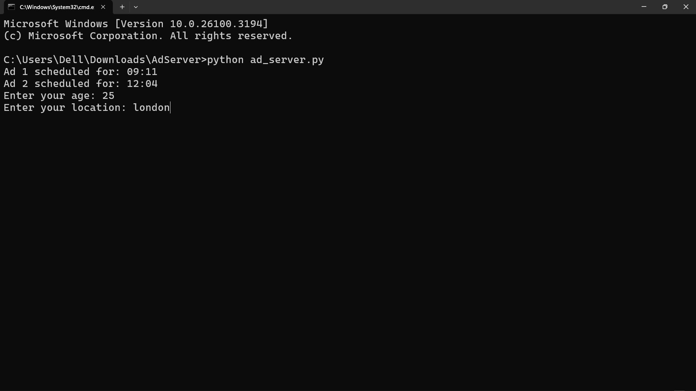
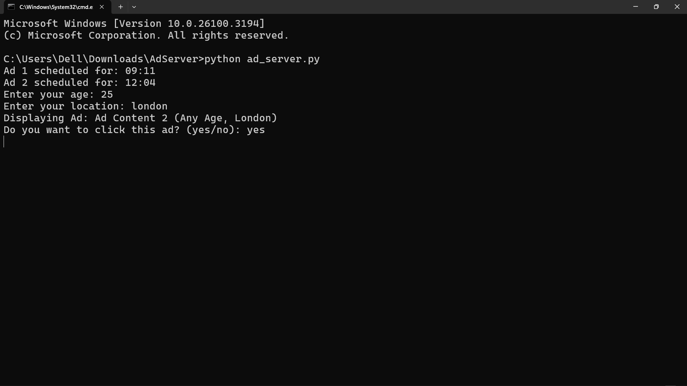

# Simple Ad Server

This project implements a basic ad server in Python using SQLite for data persistence and the `schedule` library for ad scheduling. It includes features for ad targeting, reporting, and basic data analysis.

## Features

*   **Ad Scheduling:** Schedule ads to be displayed at specific times using the `schedule` library.
*   **Targeting:** Implement basic user targeting based on age and location.
*   **Reporting:** Track ad impressions and clicks, providing basic performance metrics.
*   **Data Persistence:** Store ad statistics in an SQLite database for persistence across sessions.
*   **Data Analysis:** Includes functions to retrieve the most popular ad, the ad with the highest click-through rate, and total impressions for a given ad.

## Here are some Screenshots

### 1. Ad Schedule Info

### 2. Enter Details

### 3. Ad Relavant

### 4. SQL lite Database Schema

### 5. Updated Database  

### 5. Add not relavant  

## Getting Started

### Prerequisites

*   Python 3.x
*   `schedule` library: `pip install schedule`
*   `pytz` library: `pip install pytz`
*   SQLite database browser (e.g., DB Browser for SQLite) - Optional but recommended for viewing the database.

### Installation

1.  Clone the repository (or download the `ad_server.py` file).
2.  Navigate to the project directory in your terminal.

### Usage

1.  Run the ad server script: `python ad_server.py`
2.  The script will start running and display scheduled ads at the specified times.
3.  When an ad is scheduled, the script will prompt you for your age and location.
4.  The script will then display the ad (if it's relevant to your demographics) and ask if you want to "click" it.
5.  Ad statistics (impressions, clicks, most popular ad, highest CTR ad, total impressions for an ad) will be printed to the console every 10 seconds.
6.  The ad statistics are also stored in the `ad_stats.db` SQLite database file.

## Code Overview

*   `ad_server.py`: The main Python script containing the ad server logic.
*   `ad_stats.db`: The SQLite database file where ad statistics are stored.

## Scheduling

Ads are scheduled using the `schedule` library. You can modify the scheduled times in the `ad_server.py` file.  The example code schedules ads for 9:00 AM and 8:30 PM Indian Standard Time (IST).

## Targeting

Basic targeting is implemented based on age and location. You can modify the targeting criteria for each ad in the `ad_server.py` file.

## Reporting

The script tracks impressions and clicks for each ad.  It also calculates and reports the most popular ad (most impressions) and the ad with the highest click-through rate (CTR).

## Database

The `ad_stats` table in the SQLite database stores the ad statistics.  The table has the following columns:

*   `ad_content` (TEXT, PRIMARY KEY): The content of the ad.
*   `impressions` (INTEGER): The number of times the ad has been displayed.
*   `clicks` (INTEGER): The number of times the ad has been clicked.

## Future Enhancements

*   More sophisticated targeting options (e.g., demographics, interests).
*   Improved reporting features (e.g., click-through rate calculation, time-based reporting).
*   Integration with a web framework (e.g., Flask, Django) to display ads on a web page.
*   Support for different ad formats (e.g., images, videos).

## Contributing

Contributions are welcome\! Please submit pull requests for bug fixes, new features, or improvements.

## License

This project is licensed under the [MIT License]
